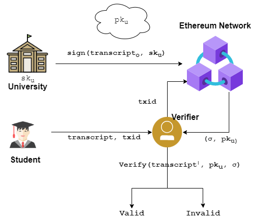

# Proof of Education

Proof of Education is a comprehensive platform built using blockchain technology to solve the problem of transcript forgery. Educational institutions upload the transcript directly to the blockchain and an independent third-party can verify the validity and integrity of the transcript present on the blockchain.

```shell
git clone 
cd proof-of-education
npm install
npx hardhat node
npx hardhat run scripts/deploy.js --network localhost
npm start
```

`npx hardhat node` creates a local node and gives 20 EOA with 10000 ethers. `npx hardhat run scripts/deploy.js --network localhost` deploys the contract to the local network. One can then run `npm start` to start the react app and interact with the platfrom. 

## Interface
1. Login: Using metamask wallet a university logins with the site. 
2. Upload Document: The university can then upload the trancripts. At the backend a hash of the transcript is created and signed using the univeristy's secret key. The signature and the public key of the university is uploaded to the network. The upload documnet returns the transaction id which the verifier uses to verify. 
3. Verify Document: An independent verifier can verify the validity of the transcript using the transcation id and the transcript a student provides. 


